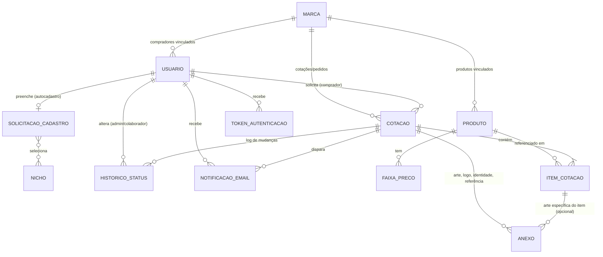

# Portal do Personalizado — TPO Embalagens
## Modelo de Dados (v1.5)

**Baseado em:** PRD v2.1
**Data:** 29/08/2026

---

## 1. Diagrama de entidades e relacionamentos

**Nota de modelagem:** o PRD (seção 6.2) definiu um único fluxo de 12 status cobrindo desde "Em cotação" até "Recebido". Por isso, **Cotação e Pedido foram unificados em uma única entidade (`COTACAO`)** — o "pedido" nada mais é do que a cotação em um estágio avançado de status, e não um registro separado. Isso simplifica o modelo e evita duplicidade de dados entre as duas fases.

---

## 2. Entidades e atributos

### 2.1 MARCA

Empresa cliente da TPO. Só pode ser criada pelo Administrador.

| Campo | Tipo | Regra |
|---|---|---|
| id | PK | — |
| nome_marca | texto | Obrigatório |
| razao_social | texto | Obrigatório |
| cnpj | texto | Obrigatório, único |
| endereco_completo | texto | Obrigatório |
| ativa | booleano | Default: verdadeiro |
| criado_por | FK → Usuario | Sempre um Administrador |
| data_criacao | data/hora | — |

### 2.2 USUARIO

Base de todos os perfis de acesso.

| Campo | Tipo | Regra |
|---|---|---|
| id | PK | — |
| nome_completo | texto | Obrigatório |
| email | texto | Obrigatório, único — usado no login |
| cpf | texto | Obrigatório para perfil Comprador/Visitante |
| whatsapp | texto | Obrigatório para perfil Comprador/Visitante |
| perfil | enum | `administrador` / `colaborador` / `visitante` / `comprador` |
| subtipo_comprador | enum, nulo | `padrao` / `gerente` — só se perfil = comprador; **definido/alterado pelo Administrador a qualquer momento após o cadastro** |
| marca_id | FK → Marca, nulo | **Obrigatório se perfil = comprador**; nulo para admin/colaborador/visitante |
| origem_cadastro | enum | `autocadastro` (formulário público) / `cadastro_tpo` (feito pelo Administrador) |
| status_cadastro | enum | `pendente_aprovacao` / `aprovado` / `recusado` |
| aprovado_por | FK → Usuario, nulo | **Definido:** sempre um Administrador (Colaborador tem acesso de visualização, sem poder aprovar/recusar, por ora) |
| data_aprovacao | data/hora, nulo | — |
| ativo | booleano | Default: verdadeiro |
| data_criacao | data/hora | — |

**Regra de transição:** todo Usuario nasce como `visitante` com `status_cadastro = pendente_aprovacao` (seja por autocadastro ou cadastro feito pela TPO). Quando aprovado, `perfil` muda para `comprador`, `subtipo_comprador` é definido (padrão por default) e `marca_id` passa a ser obrigatório.

### 2.3 SOLICITACAO_CADASTRO

Dados da empresa coletados no formulário público de autocadastro (caminho A). Existe apenas para usuários com `origem_cadastro = autocadastro`.

| Campo | Tipo | Regra |
|---|---|---|
| id | PK | — |
| usuario_id | FK → Usuario | 1:1 |
| razao_social | texto | Obrigatório |
| cnpj | texto | Obrigatório |
| nome_marca_pretendida | texto | Nome/indicação da MARCA informada pelo Visitante — **não é ainda um registro em MARCA**; usada pelo Admin como referência ao aprovar e vincular/criar a MARCA definitiva |
| endereco_completo | texto | Obrigatório |
| data_envio | data/hora | — |

### 2.4 NICHO (tabela de apoio)

Lista fixa de opções do campo "Nicho do estabelecimento".

| Campo | Tipo |
|---|---|
| id | PK |
| nome | Oriental / Pizzaria / Hamburgueria / Confeitaria / Salgados / Esfiha / Refeições / Pastelaria / Marmitas / Padaria / Carnes |

### 2.5 SOLICITACAO_CADASTRO_NICHO (associativa N:N)

| Campo | Tipo |
|---|---|
| solicitacao_cadastro_id | FK → Solicitacao_Cadastro |
| nicho_id | FK → Nicho |

*(Permite múltipla escolha de nichos por solicitação, conforme definido no PRD.)*

### 2.6 PRODUTO

| Campo | Tipo | Regra |
|---|---|---|
| id | PK | — |
| marca_id | FK → Marca | **Obrigatório** — todo produto cadastrado no catálogo pertence a uma MARCA |
| nome | texto | Obrigatório |
| descricao | texto | Dimensões, material, acabamento etc. (a detalhar) |
| ativo | booleano | Default: verdadeiro |
| data_criacao | data/hora | — |

*(Produtos "sob especificação" pedidos numa cotação fora do catálogo **não** geram um registro em Produto — ficam descritos livremente em `ITEM_COTACAO.descricao_livre`, ver 2.9.)*

### 2.7 FAIXA_PRECO

**Confirmado:** cada produto pode ter várias faixas de preço por quantidade — ex.: 1.000 unidades a R$ 1,00/un, 2.000 unidades a R$ 0,95/un.

| Campo | Tipo | Regra |
|---|---|---|
| id | PK | — |
| produto_id | FK → Produto | Obrigatório |
| quantidade_minima | inteiro | Obrigatório — quantidade a partir da qual esta faixa vale (ex.: 1.000; 2.000) |
| quantidade_maxima | inteiro, nulo | Opcional — normalmente nulo; a faixa vale até a `quantidade_minima` da próxima faixa cadastrada para o mesmo produto |
| preco_unitario | decimal | Obrigatório — preço por unidade nesta faixa (ex.: R$ 1,00; R$ 0,95) |

*(Um produto com uma única faixa cadastrada tem preço único, independente da quantidade.)*

### 2.8 COTACAO

Entidade unificada cotação → pedido (ver nota de modelagem na seção 1).

| Campo | Tipo | Regra |
|---|---|---|
| id | PK | — |
| numero | texto | **Definido:** prefixo fixo "10" + 5 dígitos sequenciais, sem separador — ex.: `1000146` |
| comprador_id | FK → Usuario | Comprador que solicitou |
| marca_id | FK → Marca | Herdado do comprador |
| status | enum | `em_cotacao` / `em_cotacao_aguardando_aprovacao` / `em_aprovacao_prototipo_3d` / `em_aprovacao_prototipo_fisico` / `financeiro_aguardando_liberacao` / `financeiro_liberado` / `pre_producao` / `em_producao` / `em_expedicao` / `pronto_para_envio` / `enviado` / `recebido` (12 valores — seção 6.2 do PRD v1.7) |
| status_fase | enum, derivado | `cotacao` / `aprovacao` / `financeiro` / `producao` / `entrega` — agrupamento das 12 etapas em 5 fases, útil para exibir o progresso ao comprador (Painel de Acompanhamento) sem repetir a lógica de agrupamento em cada tela |
| tipo_precificacao | enum | `automatica` (produto do catálogo) / `manual` (produto sob especificação) |
| prazo_retorno_manual | data, nulo | Só quando `tipo_precificacao = manual`: data-limite de 5 dias úteis para o Admin retornar |
| valor_total_sugerido | decimal, nulo | Soma calculada automaticamente (quando aplicável) |
| valor_total_final | decimal, nulo | Definido/ajustado pelo Administrador na revisão (exclusivo, por ora) |
| revisado_por | FK → Usuario, nulo | **Definido:** sempre um Administrador (Colaborador só visualiza a cotação) |
| data_solicitacao | data/hora | — |
| data_ultima_atualizacao | data/hora | — |

### 2.9 ITEM_COTACAO

| Campo | Tipo | Regra |
|---|---|---|
| id | PK | — |
| cotacao_id | FK → Cotacao | Obrigatório |
| produto_id | FK → Produto, nulo | Preenchido quando o item vem do catálogo |
| descricao_livre | texto, nulo | Preenchido quando o item é um produto sob especificação (fora do catálogo) |
| quantidade | inteiro | Obrigatório |
| preco_unitario_sugerido | decimal, nulo | Calculado automaticamente via Faixa_Preco, se aplicável |
| preco_unitario_final | decimal, nulo | Definido pelo Administrador na revisão (exclusivo, por ora) |

*(Regra: exatamente um entre `produto_id` e `descricao_livre` deve estar preenchido por item. Anexos do item ficam em `ANEXO.item_cotacao_id`, seção 2.11.)*

### 2.10 HISTORICO_STATUS

Log de auditoria das mudanças manuais de status (seção 6.2 do PRD).

| Campo | Tipo | Regra |
|---|---|---|
| id | PK | — |
| cotacao_id | FK → Cotacao | Obrigatório |
| status_anterior | enum, nulo | — |
| status_novo | enum | — |
| alterado_por | FK → Usuario | **Definido:** sempre um Administrador — **nunca automático**, e Colaborador não altera status por ora |
| data_alteracao | data/hora | — |

### 2.11 ANEXO

**Definido:** todo comprador deve anexar arquivos à solicitação de cotação — arte, logo, identidade da marca, foto da embalagem de referência. Vale tanto para produto do catálogo quanto sob especificação.

| Campo | Tipo | Regra |
|---|---|---|
| id | PK | — |
| cotacao_id | FK → Cotacao | Obrigatório — todo anexo pertence a uma cotação |
| item_cotacao_id | FK → Item_Cotacao, nulo | Preenchido quando o anexo é específico de um item (ex.: arte de um produto); nulo quando é um anexo geral da cotação (ex.: logo/identidade da marca) |
| nome_arquivo | texto | — |
| tipo_arquivo | texto | **Definido:** aceita todos os formatos de imagem e de documento (extensão/MIME específica a validar na implementação) |
| tamanho_bytes | inteiro | **Definido:** máximo 20MB por arquivo (validação na submissão) |
| url_arquivo | texto | Aponta para o arquivo armazenado na infraestrutura Vercel (ver nota abaixo) |
| enviado_por | FK → Usuario | — |
| data_envio | data/hora | — |

*(Regra: pelo menos um `ANEXO` deve existir por `COTACAO` no momento do envio — obrigatoriedade validada na submissão do formulário.)*

**Armazenamento (definido):** os arquivos ficam na infraestrutura Vercel, junto com o restante do sistema. A TPO indicou "banco de dados da Vercel" — vale confirmar na fase técnica se isso é Vercel Postgres (armazenando o arquivo como binário) ou Vercel Blob (armazenamento de arquivos, com a URL referenciada no banco), que é o padrão mais comum para esse tipo de anexo.

### 2.12 TOKEN_AUTENTICACAO

| Campo | Tipo | Regra |
|---|---|---|
| id | PK | — |
| usuario_id | FK → Usuario | — |
| codigo | texto (numérico) | — |
| criado_em | data/hora | — |
| expira_em | data/hora | `criado_em` + 5 minutos |
| tentativas_invalidas | inteiro | Default 0; bloqueia em 5 |
| bloqueado_ate | data/hora, nulo | `momento_do_bloqueio` + 15 minutos (desbloqueio automático) |
| reenviado_em | data/hora, nulo | Controla a janela de 120s para permitir novo reenvio |

### 2.13 NOTIFICACAO_EMAIL

Log das notificações disparadas (todos os eventos, conforme PRD seção 7).

| Campo | Tipo | Regra |
|---|---|---|
| id | PK | — |
| usuario_id | FK → Usuario | Destinatário |
| cotacao_id | FK → Cotacao, nulo | Quando aplicável |
| tipo_evento | enum | Ex.: `cadastro_aprovado`, `cadastro_recusado`, `cotacao_calculada`, `cotacao_revisada`, `mudanca_status` (um por status da seção 6.2), etc. |
| enviado_em | data/hora | — |

---

## 3. Regras de negócio consolidadas

1. Todo **Comprador** e todo **Produto** têm vínculo obrigatório com uma **MARCA** (regra original do projeto).
2. Apenas o **Administrador** cria MARCAS e faz vinculações de compradores/produtos a elas.
3. **Visitante** é o estágio inicial de qualquer cliente novo (por autocadastro ou cadastro pela TPO) — só vira **Comprador** após aprovação.
4. O subtipo **Padrão/Gerente** é definido pelo Administrador após o cadastro existir, e pode ser alterado depois.
5. Precificação automática usa apenas **produto + quantidade**; produtos sob especificação (fora do catálogo) vão direto para precificação manual, com **retorno em até 5 dias úteis**.
6. Os 12 status de `COTACAO` (agrupados nas fases Cotação, Aprovação, Financeiro, Produção e Entrega) só mudam **manualmente**, e por ora **exclusivamente pelo Administrador** — nunca automaticamente. O Colaborador visualiza, mas não altera.
7. Token de login: numérico, validade de 5 minutos, reenvio a cada 120s, bloqueio após 5 tentativas incorretas, desbloqueio automático após 15 minutos.
8. Todo evento relevante do ciclo de vida da cotação gera uma notificação por e-mail.
9. Toda cotação numerada sequencialmente no momento da criação (prefixo "10" + 5 dígitos, sem separador — ex.: `1000146`).
10. Toda cotação exige pelo menos um **anexo** (arte, logo, identidade da marca ou foto de referência) para ser enviada — vale para produto do catálogo e sob especificação. Aceita todos os formatos de imagem e documento; armazenado na infraestrutura Vercel.
11. Produtos do catálogo podem ter **múltiplas faixas de preço por quantidade**; o cálculo automático usa a faixa correspondente à quantidade solicitada.

---

## 4. Pontos a decidir na etapa técnica

- Templates exatos de cada tipo de e-mail em `NOTIFICACAO_EMAIL`.
- Confirmar se o storage de `ANEXO` será Vercel Postgres (binário) ou Vercel Blob (arquivo + URL referenciada) — ambos rodando na infraestrutura Vercel do sistema.
